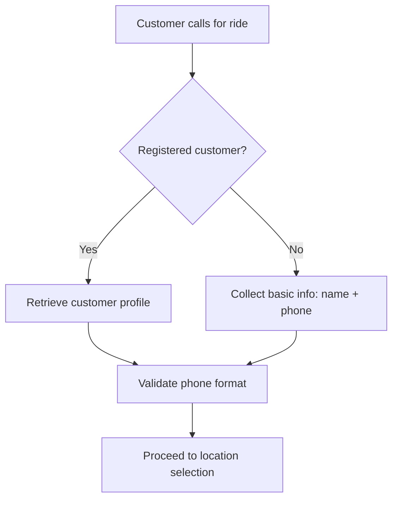
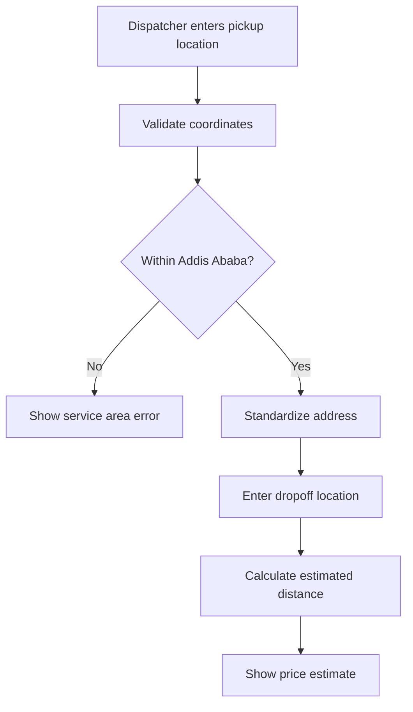
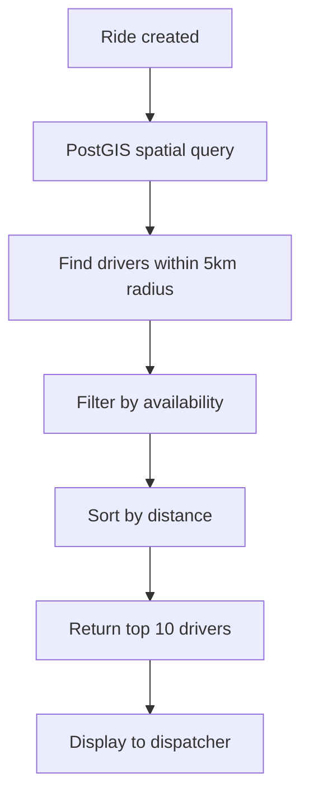
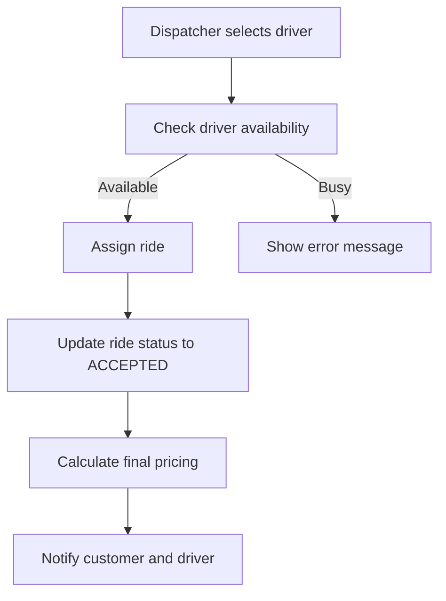

# Niyat Ride Backend System

A comprehensive ride-hailing backend system built with Spring Boot 3.5.4, featuring advanced geospatial capabilities with PostgreSQL and PostGIS for efficient driver discovery and location-based services.

## 🎯 Project Overview

Niyat Ride is a modern ride-hailing platform designed for the Ethiopian market, specifically optimized for Addis Ababa operations. The system provides robust functionality for dispatchers, admins, drivers, and customers with real-time geospatial operations.

### Target Audience
- **Dispatchers**: Create and manage ride requests, handle customer interactions
- **Admins**: System administration, pricing management, user oversight
- **Drivers**: Receive and fulfill ride requests (mobile app integration)
- **Customers**: Request rides, track progress (mobile app integration)

### Core Features
- Advanced geospatial driver discovery using PostGIS
- Flexible customer handling (registered and unregistered)
- Dynamic base price management system
- Real-time location validation and processing
- Comprehensive admin dashboard capabilities
- Ethiopian phone number validation (+251 format)

---

## 🚀 Setup Instructions

### Prerequisites
- **Java 21** or higher
- **PostgreSQL 15** or higher with PostGIS extension
- **Maven 3.8** or higher
- **Git**

### 1. PostgreSQL with PostGIS Setup

#### Install PostgreSQL and PostGIS
```bash
# Ubuntu/Debian
sudo apt update
sudo apt install postgresql postgresql-contrib postgis postgresql-15-postgis-3

# macOS (using Homebrew)
brew install postgresql postgis

# Windows: Download from https://www.postgresql.org/download/windows/
```

#### Create Database and Enable PostGIS
```sql
-- Connect as postgres user
sudo -u postgres psql

-- Create database
CREATE DATABASE niyat_ride;

-- Connect to the new database
\c niyat_ride;

-- Enable PostGIS extension
CREATE EXTENSION postgis;
CREATE EXTENSION postgis_topology;

-- Create user (optional)
CREATE USER niyat_user WITH PASSWORD 'your_password';
GRANT ALL PRIVILEGES ON DATABASE niyat_ride TO niyat_user;
```

### 2. Environment Configuration

#### Clone Repository
```bash
git clone <repository-url>
cd Niyat-Ride/backend
```

#### Configure Database Connection
Update `src/main/resources/application.properties`:
```properties
# Database - PostgreSQL with PostGIS
spring.datasource.url=jdbc:postgresql://localhost:5432/niyat_ride
spring.datasource.username=postgres  # or your custom user
spring.datasource.password=your_password
```

#### Environment Variables (Optional)
```bash
export NYAT_ADMIN_USERNAME=admin@niyat.com
export NYAT_ADMIN_PASSWORD=SecurePassword123
export NYAT_ADMIN_PHONE=+251911000000
```

### 3. Application Startup

#### Build and Run
```bash
# Install dependencies and build
mvn clean install

# Run the application
mvn spring-boot:run

# Or run the JAR file
java -jar target/ride-0.0.1-SNAPSHOT.jar
```

#### Verify Installation
- Application runs on: `http://localhost:8080`
- Swagger UI: `http://localhost:8080/swagger-ui.html`
- API Docs: `http://localhost:8080/v3/api-docs`

---

## 👨‍💼 Admin Features

### User Management
Comprehensive user oversight across all user types (customers, drivers, dispatchers).

#### Key Endpoints
```http
GET /api/admin/users/customers     # List all customers with filtering
GET /api/admin/users/drivers       # List all drivers with status filtering  
GET /api/admin/users/dispatchers   # List all dispatchers
PUT /api/admin/users/customers/{id}/status  # Update customer status
PUT /api/admin/users/drivers/{id}/status    # Update driver status
```

#### Features
- **Advanced Filtering**: Status, registration date, activity level
- **Bulk Operations**: Status updates, account management
- **Activity Monitoring**: Track user engagement and performance
- **Search Capabilities**: Find users by name, phone, or ID

### Base Price Management
Centralized pricing control system replacing individual vehicle type pricing.

#### Key Endpoints
```http
GET /api/admin/pricing/base-price   # Get current base price
PUT /api/admin/pricing/base-price   # Update base price
```

#### Example Request
```json
{
  "amount": 120.00,
  "changeReason": "Market adjustment due to fuel price increase"
}
```

#### Features
- **Audit Trail**: Track all price changes with admin details
- **Validation**: Ensures positive pricing and reasonable limits
- **Automatic Initialization**: Default 100 ETB base price on startup
- **Change Reasoning**: Mandatory documentation for price updates

### Vehicle Type Management
Complete CRUD operations for vehicle categories and pricing.

#### Key Endpoints
```http
GET /api/admin/vehicle-types        # List all vehicle types
POST /api/admin/vehicle-types       # Create new vehicle type
PUT /api/admin/vehicle-types/{id}   # Update vehicle type
DELETE /api/admin/vehicle-types/{id} # Soft delete vehicle type
```

#### Example Vehicle Type
```json
{
  "name": "Standard Sedan",
  "description": "4-door sedan vehicle",
  "basePrice": 50.00,
  "pricePerKm": 8.50,
  "isActive": true
}
```

### System Monitoring
Real-time insights into platform performance and usage.

#### Key Metrics
- **Ride Analytics**: Total rides, completion rates, revenue
- **Driver Performance**: Online hours, acceptance rates, ratings
- **Geographic Coverage**: Service area utilization, demand patterns
- **Revenue Tracking**: Daily, weekly, monthly financial summaries

---

## 🚗 Dispatcher Features

### Customer Handling
Flexible system supporting both registered and unregistered customers.

#### Registered Customers
- **Full Profile Access**: Complete customer history and preferences
- **Quick Booking**: Stored addresses and payment methods
- **Loyalty Integration**: Reward points and discount eligibility

#### Unregistered Customers
- **Instant Service**: No registration required for immediate rides
- **Minimal Data Collection**: Name and phone number only
- **Conversion Tracking**: Monitor registration conversion rates

#### Phone Validation
```json
{
  "phoneNumber": "+251911234567",  // Automatically formatted
  "isValid": true,
  "normalizedNumber": "+251911234567"
}
```

### Ride Creation Process
Streamlined workflow for efficient ride management.

#### Enhanced Request Structure
```json
{
  "customerInfo": {
    "isNewCustomer": false,
    "phoneNumber": "+251911234567",
    "name": "John Doe"
  },
  "pickupLocation": {
    "latitude": 9.0307,
    "longitude": 38.7578,
    "address": "Bole International Airport",
    "landmark": "Main Terminal",
    "notes": "Gate 2 pickup area"
  },
  "dropoffLocation": {
    "latitude": 9.0058,
    "longitude": 38.7636,
    "address": "Meskel Square",
    "landmark": "Central monument"
  },
  "vehicleTypeId": 1,
  "dispatcherId": 123,
  "notes": "Customer prefers air conditioning"
}
```

#### Automatic Features
- **Location Validation**: Verifies coordinates within Addis Ababa service area
- **Address Standardization**: Formats and validates address information
- **Distance Calculation**: Automatic route distance estimation
- **Price Estimation**: Base price + distance-based calculation

### Driver Discovery and Assignment
Advanced geospatial matching system using PostGIS.

#### Nearby Driver Response
```json
{
  "nearbyDrivers": [
    {
      "driverId": 456,
      "driverName": "Ahmed Hassan",
      "phoneNumber": "+251922345678",
      "distanceKm": 1.2,
      "estimatedArrivalMinutes": 4,
      "vehicleInfo": {
        "licensePlate": "AA-123-456",
        "vehicleModel": "Toyota Corolla",
        "vehicleColor": "White"
      }
    }
  ]
}
```

#### Assignment Features
- **Real-time Availability**: Checks for active rides and online status
- **Distance Optimization**: Sorts by proximity to pickup location
- **Automatic Pricing**: Updates ride cost upon driver assignment
- **Status Tracking**: Monitors ride progression through statuses

### Ride Monitoring
Comprehensive oversight of active and completed rides.

#### Key Endpoints
```http
GET /api/dispatcher/rides?dispatcherId=123  # List dispatcher's rides
GET /api/dispatcher/rides/{id}              # Get specific ride details
PATCH /api/dispatcher/rides/{id}/assign-driver  # Assign driver to ride
```

#### Monitoring Features
- **Real-time Updates**: Live status changes and location tracking
- **Communication Tools**: Direct contact with drivers and customers
- **Issue Resolution**: Handle cancellations, disputes, and special requests
- **Performance Metrics**: Track dispatcher efficiency and success rates

---

## 🔧 API Reference

### Authentication
All API endpoints require JWT authentication except for public registration endpoints.

#### Headers
```http
Authorization: Bearer <jwt_token>
Content-Type: application/json
```

#### Authentication Endpoints
```http
POST /api/auth/login     # User login
POST /api/auth/register  # Customer registration
POST /api/auth/refresh   # Token refresh
```

### Core Endpoints Summary

#### Admin APIs
| Method | Endpoint | Description |
|--------|----------|-------------|
| GET | `/api/admin/users/customers` | List customers with filtering |
| GET | `/api/admin/users/drivers` | List drivers with status filter |
| GET | `/api/admin/pricing/base-price` | Get current base price |
| PUT | `/api/admin/pricing/base-price` | Update base price |
| GET | `/api/admin/vehicle-types` | List vehicle types |
| POST | `/api/admin/vehicle-types` | Create vehicle type |

#### Dispatcher APIs
| Method | Endpoint | Description |
|--------|----------|-------------|
| POST | `/api/dispatcher/rides` | Create new ride |
| GET | `/api/dispatcher/rides` | List dispatcher rides |
| GET | `/api/dispatcher/rides/{id}` | Get ride details |
| PATCH | `/api/dispatcher/rides/{id}/assign-driver` | Assign driver |

#### Request/Response Examples

##### Create Ride Request
```http
POST /api/dispatcher/rides
Content-Type: application/json

{
  "customerInfo": {
    "isNewCustomer": true,
    "phoneNumber": "+251911234567",
    "name": "Sarah Johnson"
  },
  "pickupLocation": {
    "latitude": 9.0307,
    "longitude": 38.7578,
    "address": "Bole International Airport"
  },
  "dropoffLocation": {
    "latitude": 9.0058,
    "longitude": 38.7636,
    "address": "Meskel Square"
  },
  "vehicleTypeId": 1,
  "dispatcherId": 123
}
```

##### Create Ride Response
```http
HTTP/1.1 201 Created
Location: /api/dispatcher/rides/789

{
  "id": 789,
  "customerId": 456,
  "customerPhone": "+251911234567",
  "status": "REQUESTED",
  "pickupLocation": {
    "latitude": 9.0307,
    "longitude": 38.7578,
    "address": "Bole International Airport"
  },
  "dropoffLocation": {
    "latitude": 9.0058,
    "longitude": 38.7636,
    "address": "Meskel Square"
  },
  "estimatedDistanceKm": 15.2,
  "costDetails": {
    "basePrice": 100.00,
    "distancePrice": 129.20,
    "totalPrice": 229.20,
    "currency": "ETB"
  },
  "nearbyDrivers": [
    {
      "driverId": 101,
      "driverName": "Bekele Molla",
      "distanceKm": 0.8,
      "estimatedArrivalMinutes": 3
    }
  ],
  "requestedAt": "2024-08-21T19:30:00Z"
}
```

---

## 📊 Workflow Examples

### 1. Standard Ride Creation Workflow

#### Step 1: Customer Information


#### Step 2: Location Processing


#### Step 3: Driver Discovery


#### Step 4: Assignment and Completion


### 2. Base Price Update Workflow

#### Admin Process
1. **Review Current Pricing**: Admin accesses pricing dashboard
2. **Market Analysis**: Consider fuel costs, demand, competition
3. **Update Request**: Submit new price with detailed reasoning
4. **System Validation**: Verify price is within acceptable ranges
5. **Implementation**: New price applies to all future rides
6. **Audit Logging**: Change recorded with admin details and timestamp

### 3. Customer Service Resolution

#### Unregistered Customer Support
1. **Phone Verification**: Validate Ethiopian phone format
2. **Ride History**: Search by phone number for previous rides
3. **Issue Resolution**: Handle complaints, refunds, feedback
4. **Registration Encouragement**: Offer benefits for account creation

---

## 🗄️ Database Schema

### Key Tables and Relationships

#### Core User Tables
```sql
-- Users (base table with inheritance)
CREATE TABLE users (
    id BIGSERIAL PRIMARY KEY,
    first_name VARCHAR(100) NOT NULL,
    last_name VARCHAR(100) NOT NULL,
    phone_number VARCHAR(20) UNIQUE NOT NULL,
    email VARCHAR(150) UNIQUE,
    password_hash VARCHAR(255),
    status VARCHAR(20) DEFAULT 'ACTIVE',
    created_at TIMESTAMP DEFAULT CURRENT_TIMESTAMP,
    updated_at TIMESTAMP DEFAULT CURRENT_TIMESTAMP
);

-- Drivers (extends users)
CREATE TABLE drivers (
    id BIGINT PRIMARY KEY REFERENCES users(id),
    license_number VARCHAR(50) UNIQUE NOT NULL,
    license_image_path TEXT,
    current_location GEOMETRY(Point, 4326),
    current_latitude DOUBLE PRECISION,
    current_longitude DOUBLE PRECISION,
    is_online BOOLEAN DEFAULT FALSE,
    last_location_update TIMESTAMP
);

-- Customers (extends users)
CREATE TABLE customers (
    id BIGINT PRIMARY KEY REFERENCES users(id),
    loyalty_points INTEGER DEFAULT 0,
    preferred_payment_method VARCHAR(50)
);
```

#### Ride Management Tables
```sql
-- Ride requests with spatial data
CREATE TABLE ride_requests (
    id BIGSERIAL PRIMARY KEY,
    passenger_id BIGINT REFERENCES customers(id),
    driver_id BIGINT REFERENCES drivers(id),
    dispatcher_id BIGINT REFERENCES users(id),
    vehicle_type_id BIGINT NOT NULL,
    
    -- PostGIS spatial columns
    pickup_location GEOMETRY(Point, 4326),
    dropoff_location GEOMETRY(Point, 4326),
    
    -- Backup coordinates
    pickup_latitude DOUBLE PRECISION,
    pickup_longitude DOUBLE PRECISION,
    pickup_address TEXT,
    dropoff_latitude DOUBLE PRECISION,
    dropoff_longitude DOUBLE PRECISION,
    dropoff_address TEXT,
    
    status VARCHAR(20) NOT NULL,
    estimated_cost DECIMAL(10,2),
    final_cost DECIMAL(10,2),
    distance_km DOUBLE PRECISION,
    
    requested_at TIMESTAMP DEFAULT CURRENT_TIMESTAMP,
    accepted_at TIMESTAMP,
    started_at TIMESTAMP,
    completed_at TIMESTAMP,
    cancelled_at TIMESTAMP,
    
    notes TEXT
);
```

#### Pricing and Configuration
```sql
-- Base price management
CREATE TABLE base_prices (
    id BIGSERIAL PRIMARY KEY,
    amount DECIMAL(10,2) NOT NULL,
    currency VARCHAR(3) DEFAULT 'ETB',
    is_active BOOLEAN DEFAULT TRUE,
    change_reason TEXT,
    updated_by_admin_id BIGINT,
    created_at TIMESTAMP DEFAULT CURRENT_TIMESTAMP,
    updated_at TIMESTAMP DEFAULT CURRENT_TIMESTAMP
);

-- Vehicle types
CREATE TABLE vehicle_types (
    id BIGSERIAL PRIMARY KEY,
    name VARCHAR(100) NOT NULL,
    description TEXT,
    base_price DECIMAL(10,2) NOT NULL,
    price_per_km DECIMAL(10,2) NOT NULL,
    is_active BOOLEAN DEFAULT TRUE,
    created_at TIMESTAMP DEFAULT CURRENT_TIMESTAMP,
    deleted_at TIMESTAMP
);

-- Service areas
CREATE TABLE service_areas (
    id SERIAL PRIMARY KEY,
    name VARCHAR(100) NOT NULL,
    boundary GEOMETRY(POLYGON, 4326) NOT NULL,
    is_active BOOLEAN DEFAULT TRUE,
    created_at TIMESTAMP DEFAULT CURRENT_TIMESTAMP
);
```

### Spatial Indexes for Performance

```sql
-- Critical indexes for geospatial queries
CREATE INDEX idx_drivers_current_location ON drivers USING GIST (current_location);
CREATE INDEX idx_ride_requests_pickup_location ON ride_requests USING GIST (pickup_location);
CREATE INDEX idx_ride_requests_dropoff_location ON ride_requests USING GIST (dropoff_location);

-- Composite indexes for common queries
CREATE INDEX idx_drivers_online_location ON drivers (is_online) WHERE is_online = true;
CREATE INDEX idx_ride_requests_status_driver ON ride_requests (status, driver_id);
CREATE INDEX idx_ride_requests_dispatcher_status ON ride_requests (dispatcher_id, status);
```

### Important Fields and Constraints

#### Geospatial Fields
- **SRID 4326**: WGS84 coordinate system for GPS coordinates
- **GEOMETRY(Point, 4326)**: PostGIS point type for precise location storage
- **GIST Indexes**: Optimized spatial indexes for distance queries

#### Business Constraints
- **Phone Uniqueness**: Prevents duplicate accounts
- **Active Status Checks**: Ensures only active entities participate
- **Soft Deletes**: Maintains data integrity for historical records
- **Audit Trails**: Tracks all significant changes with timestamps

### Performance Optimization Strategy

#### Spatial Query Optimization
- **ST_DWithin()**: Efficient radius searches using spatial indexes
- **ST_Distance()**: Accurate distance calculations
- **Bounding Box Queries**: Pre-filter before expensive distance calculations

#### Connection Pooling
```properties
# HikariCP optimization for PostgreSQL
spring.datasource.hikari.maximum-pool-size=20
spring.datasource.hikari.minimum-idle=5
spring.datasource.hikari.connection-timeout=20000
spring.datasource.hikari.idle-timeout=300000
```

---

## 🔧 Development and Deployment

### Running Tests
```bash
# Run all tests
mvn test

# Run specific test class
mvn test -Dtest=BasePriceServiceTest

# Run with coverage
mvn test jacoco:report
```

### Building for Production
```bash
# Create production JAR
mvn clean package -Pproduction

# Build Docker image
docker build -t niyat-ride-backend .

# Run with Docker Compose
docker-compose up -d
```

### Environment Profiles
```properties
# application-dev.properties
spring.jpa.hibernate.ddl-auto=update
spring.jpa.show-sql=true
logging.level.com.niyat.ride=DEBUG

# application-prod.properties  
spring.jpa.hibernate.ddl-auto=validate
spring.jpa.show-sql=false
logging.level.com.niyat.ride=INFO
```

---

## 🛠️ Troubleshooting

### Common Issues

#### PostGIS Extension Not Found
```sql
-- Check if PostGIS is installed
SELECT PostGIS_Version();

-- Install if missing
CREATE EXTENSION IF NOT EXISTS postgis;
```

#### Spatial Query Errors
```java
// Ensure proper SRID in queries
String point = String.format("POINT(%f %f)", longitude, latitude);
// Note: longitude first, then latitude in PostGIS
```

#### Connection Pool Issues
```properties
# Increase pool size for high load
spring.datasource.hikari.maximum-pool-size=50
spring.datasource.hikari.leak-detection-threshold=60000
```

### Performance Monitoring
- **Spatial Index Usage**: Monitor query execution plans
- **Connection Pool Metrics**: Track active/idle connections
- **Response Times**: Monitor API endpoint performance
- **Database Locks**: Watch for long-running spatial queries

---

## 📈 Future Enhancements

### Planned Features
- **Real-time Driver Tracking**: Live location updates via WebSocket
- **Machine Learning**: Demand prediction and dynamic pricing
- **Multi-city Support**: Expand beyond Addis Ababa
- **Advanced Analytics**: Driver performance scoring, route optimization
- **Mobile App Integration**: Native iOS and Android applications

### Technical Roadmap
- **Microservices Architecture**: Split into domain-specific services
- **Event Sourcing**: Implement CQRS pattern for ride state management
- **Redis Caching**: Cache frequently accessed driver locations
- **Elasticsearch**: Advanced search and analytics capabilities
- **Kubernetes Deployment**: Container orchestration for scalability

---

## 🤝 Contributing

### Development Standards
- **Code Style**: Follow Google Java Style Guide
- **Testing**: Minimum 80% code coverage required
- **Documentation**: Update API docs for any endpoint changes
- **Git Workflow**: Feature branches with pull request reviews

### Getting Started
1. Fork the repository
2. Create feature branch: `git checkout -b feature/amazing-feature`
3. Commit changes: `git commit -m 'Add amazing feature'`
4. Push to branch: `git push origin feature/amazing-feature`
5. Open pull request with detailed description

---

## 📄 License

This project is licensed under the MIT License - see the [LICENSE](LICENSE) file for details.

---

## 📞 Support

For technical support or business inquiries:
- **Email**: support@niyat.com
- **Phone**: +251 911 000 000
- **Documentation**: [API Documentation](http://localhost:8080/swagger-ui.html)
- **Issue Tracker**: GitHub Issues

---

*Built with ❤️ for the Ethiopian ride-hailing market*
